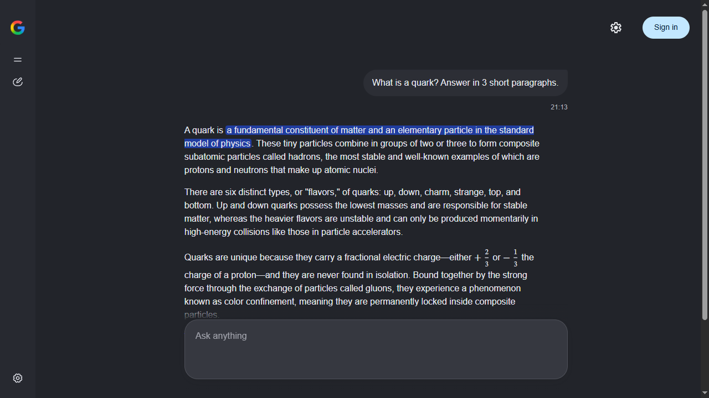

<div align="center">


# Gemini for Windows<sup>*</sup>

Google AI Mode in its own clean window. Open source, for Windows 10 and 11.

[](../../releases/latest)
[](../../releases)
[](#requirements)
[](LICENSE)

<a href="https://github.com/ishimuraxxx-ai/gemini-1.0.1/releases/latest/download/Gemini.exe"></a>

**English** · [Русский](README.ru.md) · [Website](https://ishimuraxxx-ai.github.io/gemini-1.0.1/)



</div>

## Install

1. Download **[`Gemini.exe`](https://github.com/ishimuraxxx-ai/gemini-1.0.1/releases/latest/download/Gemini.exe)**: one file, nothing to unzip.
2. Run it. AI Mode opens, and a **Gemini** shortcut appears on your Desktop and in the Start menu.

The downloaded file can be deleted afterwards: the app copies itself to `%LOCALAPPDATA%\Programs\Gemini`.

Ask anything. Sign in to Google if you want to keep your chat history.

> [!TIP]
> If Windows says **"Windows protected your PC"**, click **More info → Run anyway**. The exe isn't signed with a paid certificate. You can [verify it](#transparency) or [build it yourself](#build-from-source).

## Features

| | |
|---|---|
| 🖥️ **Its own window** | No browser tabs or address bar. Google AI Mode opens like any Windows program, with a Desktop shortcut and its own taskbar icon. |
| ✂️ **Nothing extra** | No Images / Videos / News tabs, no sources column, no extra buttons. Just the answer, centered. |
| 🎤 **Voice input with commands** | Dictate with **Ctrl+Space** in 50+ languages. Say **"send"** at the end and the question goes out. |
| 🌐 **Interface language** | Switch AI Mode's language in settings (**Ctrl+,**), independent of your Google Account. |
| 📦 **One file** | Download a single `Gemini.exe`, no installer or zip. The app, settings and your login live in one folder; your regular browser isn't touched. |
| 🔍 **Transparent builds** | The exe is built by GitHub Actions from this code, with checksums and a provenance attestation. |

## Requirements

- Windows 10 or 11
- Microsoft Edge (preinstalled on Windows)
- A Google account is optional: AI Mode answers without signing in; sign in to keep your history

## What it opens

[Google AI Mode](https://www.google.com/search?udm=50) is the AI chat in Google Search, powered by Gemini. This app is that official page, Microsoft Edge and about 120 lines of code you can read in full, plus a small extension that tidies the page up.

## Transparency

- **All code is open.** Launcher: [`launcher/Gemini.cs`](launcher/Gemini.cs). Extension: [`extension/voice.js`](extension/voice.js) and [`extension/hide.css`](extension/hide.css). Build script: [`build.ps1`](build.ps1).
- **GitHub builds the exe, not the author.** Releases come from [`.github/workflows/release.yml`](.github/workflows/release.yml), and every build log is public in the [Actions](../../actions) tab.
- **Verify the origin** of your `Gemini.exe`:
  ```
  gh attestation verify Gemini.exe -R ishimuraxxx-ai/gemini-1.0.1
  ```
- **Checksums.** Every release has `SHA256SUMS.txt`. Compare with: `Get-FileHash Gemini.exe -Algorithm SHA256`.
- **No telemetry.** The app talks only to Google.

<details>
<summary><b>How it works</b></summary>

<br>

`Gemini.exe` starts Microsoft Edge in app mode with its own profile and a small extension. The extension is embedded in the exe: on launch the downloaded exe copies itself to `%LOCALAPPDATA%\Programs\Gemini`, unpacks the extension there and keeps Gemini shortcuts on the Desktop and in the Start menu:

```
msedge.exe --user-data-dir="<folder>\profile"
           --load-extension="<folder>\extension"
           --no-first-run --no-default-browser-check
           --app=https://www.google.com/search?udm=50
```

The separate profile makes the window its own process, so the extension loads even when your regular Edge is already open.

The extension hides the search tabs, the sources column and extra buttons ([`hide.css`](extension/hide.css)), centers the chat, names the window "Gemini" with the Gemini icon instead of Google's "G" and adds voice input ([`voice.js`](extension/voice.js)).

```
%LOCALAPPDATA%\Programs\Gemini\
├── Gemini.exe        ← the app
├── extension/        ← clean-up, settings and voice input (unpacked from the exe)
└── profile/          ← your Google login (created on first run)
```

If `Gemini.exe` has an `extension/` folder next to it (a copy of this repository), it runs right there instead and doesn't copy anything:

```
Gemini/
├── Gemini.exe        ← the app (built by build.ps1)
├── Gemini.lnk        ← shortcut (Gemini.exe also puts one on the Desktop)
├── extension/        ← clean-up, settings and voice input (Edge extension)
├── launcher/         ← source of Gemini.exe
├── build.ps1         ← builds Gemini.exe from source
├── install.cmd       ← optional: Desktop and Start menu shortcuts in one click
├── uninstall.cmd     ← removes those shortcuts
└── profile/          ← your Google login (created on first run)
```

> [!WARNING]
> The `profile/` folder holds your Google login. Never share it. Git ignores it.

If you move the folder, run `Gemini.exe` from the new place: the shortcuts update themselves.

</details>

<details>
<summary><b>Voice input</b></summary>

<br>

| Action | How |
|---|---|
| Dictate into the input | **Ctrl+Space** |
| Send the message | say **"send"** at the end (also «отправить», «надіслати») |
| Clear the input | say **"clear"** (also «очистить») |
| Dictation language | **Ctrl+,** → Dictation language (50+ languages) |

Speech is recognized by Edge's built-in Web Speech API (a Microsoft cloud service), so an internet connection is required. Allow microphone access the first time.

</details>

<details>
<summary><b>Build from source</b></summary>

<br>

1. **Code → Download ZIP** (or `git clone`), unzip.
2. Double-click `install.cmd`. It builds `Gemini.exe` with the C# compiler built into Windows (.NET Framework 4) and creates shortcuts.

Rebuild manually: `powershell -ExecutionPolicy Bypass -File build.ps1`

**New release (for the author):** `git tag v1.0.3` and `git push origin v1.0.3`. GitHub Actions builds and publishes `Gemini.exe` and `SHA256SUMS.txt`.

</details>

<details>
<summary><b>Troubleshooting</b></summary>

<br>

**AI Mode says it isn't available.** AI Mode isn't offered in every country. Use a VPN with a server in a country where it is available.

**"Microphone access denied".** Click the lock icon left of the address and allow the microphone. Also check Windows Settings → Privacy → Microphone.

**A hidden panel is back, or text isn't inserted or sent.** Google probably changed the page layout. Please [open an issue](../../issues/new/choose).

</details>

<details>
<summary><b>Uninstall</b></summary>

<br>

Close Gemini, delete the folder `%LOCALAPPDATA%\Programs\Gemini` (paste this into the Explorer address bar) and the Gemini shortcuts on the Desktop and in the Start menu.

A copy of the repository: run `uninstall.cmd` to remove the shortcuts, then delete the folder.

</details>

## FAQ

<details>
<summary><b>What exactly does it open?</b></summary>
<br>
Google AI Mode (<code>google.com/search?udm=50</code>), the AI chat in Google Search powered by Gemini, in its own window with everything but the chat hidden.
</details>

<details>
<summary><b>How do I install it on Windows 10 or 11?</b></summary>
<br>
Download <code>Gemini.exe</code> from Releases (one file) and run it. A Gemini shortcut appears on your Desktop and in the Start menu.
</details>

<details>
<summary><b>Is it safe?</b></summary>
<br>
All code is open, and the exe is built publicly by GitHub Actions with checksums and a provenance attestation. The app collects no data and keeps your login only in its own folder.
</details>

<details>
<summary><b>Is it free?</b></summary>
<br>
Yes, MIT license. A Google account is optional.
</details>

<details>
<summary><b>Does it work on macOS or Linux?</b></summary>
<br>
No, only Windows 10/11 with Microsoft Edge.
</details>

---

<sub>* Unofficial app. Not affiliated with or endorsed by Google. Google and Gemini are trademarks of Google LLC. · [MIT License](LICENSE)</sub>
