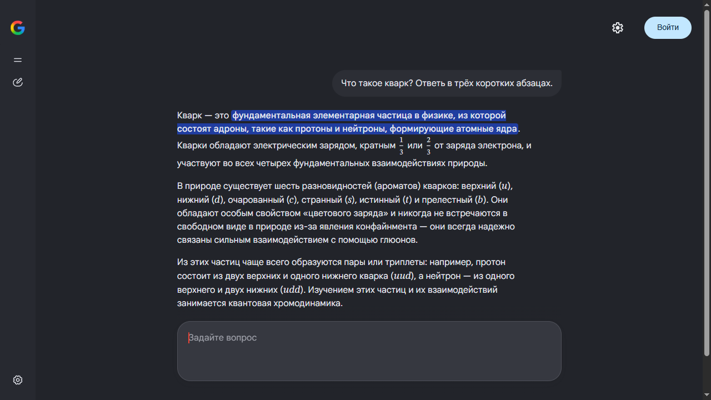

<div align="center">


# Gemini для Windows<sup>*</sup>

«Режим ИИ» Google в отдельном чистом окне. Открытый код, для Windows 10 и 11.

[](../../releases/latest)
[](../../releases)
[](#требования)
[](LICENSE)

<a href="https://github.com/ishimuraxxx-ai/gemini-1.0.1/releases/latest/download/Gemini.exe"></a>

[English](README.md) · **Русский** · [Сайт](https://ishimuraxxx-ai.github.io/gemini-1.0.1/ru/)



</div>

## Установка

1. Скачайте **[`Gemini.exe`](https://github.com/ishimuraxxx-ai/gemini-1.0.1/releases/latest/download/Gemini.exe)**: один файл, ничего распаковывать не нужно.
2. Запустите его. Откроется «Режим ИИ», а ярлык **Gemini** появится на рабочем столе и в меню «Пуск».

Скачанный файл потом можно удалить: программа копирует себя в `%LOCALAPPDATA%\Programs\Gemini`.

Задайте вопрос. Если нужна история чатов, войдите в аккаунт Google.

> [!TIP]
> Если Windows пишет **«Система Windows защитила ваш компьютер»**, нажмите **«Подробнее» → «Выполнить в любом случае»**. exe не подписан платным сертификатом. Его можно [проверить](#прозрачность) или [собрать самим](#сборка-из-исходников).

## Возможности

| | |
|---|---|
| 🖥️ **Своё окно** | Без вкладок и адресной строки. «Режим ИИ» открывается как обычная программа Windows, с ярлыком на рабочем столе и своим значком на панели задач. |
| ✂️ **Ничего лишнего** | Нет вкладок «Картинки / Видео / Новости», колонки статей справа и лишних кнопок. Только ответ, по центру. |
| 🎤 **Голосовой ввод с командами** | Диктовка по **Ctrl+Пробел** на 50+ языках. Скажите в конце **«отправить»**, и вопрос уйдёт. |
| 🌐 **Язык интерфейса** | Переключается в настройках (**Ctrl+,**), независимо от настроек аккаунта Google. |
| 📦 **Один файл** | Скачивается один `Gemini.exe`, без установщика и архивов. Программа, настройки и вход в аккаунт лежат в одной папке; ваш обычный браузер не затрагивается. |
| 🔍 **Прозрачная сборка** | exe собирает GitHub Actions из этого кода, с контрольными суммами и аттестацией происхождения. |

## Требования

- Windows 10 или 11
- Microsoft Edge (уже есть в Windows)
- Аккаунт Google по желанию: «Режим ИИ» отвечает и без входа, а со входом сохраняется история

## Что открывает программа

[«Режим ИИ»](https://www.google.com/search?udm=50) — ИИ-чат Google Поиска на базе Gemini. Эта программа — просто эта официальная страница, Microsoft Edge и около 120 строк кода, которые можно прочитать целиком, плюс небольшое расширение, которое убирает со страницы лишнее.

## Прозрачность

- **Весь код открыт.** Запускающий файл: [`launcher/Gemini.cs`](launcher/Gemini.cs). Расширение: [`extension/voice.js`](extension/voice.js) и [`extension/hide.css`](extension/hide.css). Сборка: [`build.ps1`](build.ps1).
- **exe собирает GitHub, а не автор.** Релизы делает [`.github/workflows/release.yml`](.github/workflows/release.yml), лог каждой сборки открыт во вкладке [Actions](../../actions).
- **Проверить происхождение** вашего `Gemini.exe`:
  ```
  gh attestation verify Gemini.exe -R ishimuraxxx-ai/gemini-1.0.1
  ```
- **Контрольные суммы.** В каждом релизе есть `SHA256SUMS.txt`. Сравнить: `Get-FileHash Gemini.exe -Algorithm SHA256`.
- **Никакой телеметрии.** Программа обращается только к Google.

<details>
<summary><b>Как это устроено</b></summary>

<br>

`Gemini.exe` запускает Microsoft Edge в режиме приложения со своим профилем и небольшим расширением. Расширение вшито в exe: при запуске скачанный exe копирует себя в `%LOCALAPPDATA%\Programs\Gemini`, распаковывает туда расширение и держит ярлыки Gemini на рабочем столе и в меню «Пуск»:

```
msedge.exe --user-data-dir="<папка>\profile"
           --load-extension="<папка>\extension"
           --no-first-run --no-default-browser-check
           --app=https://www.google.com/search?udm=50
```

Отдельный профиль делает окно своим процессом, поэтому расширение подключается, даже когда обычный Edge уже открыт.

Расширение прячет вкладки поиска, колонку источников и лишние кнопки ([`hide.css`](extension/hide.css)), ставит чат по центру, называет окно «Gemini» и ставит значок Gemini вместо «G» Google, добавляет голосовой ввод ([`voice.js`](extension/voice.js)).

```
%LOCALAPPDATA%\Programs\Gemini\
├── Gemini.exe        ← сама программа
├── extension/        ← чистка страницы, настройки и голосовой ввод (распакованы из exe)
└── profile/          ← ваш вход в аккаунт Google (создаётся при первом запуске)
```

Если рядом с `Gemini.exe` есть папка `extension/` (копия этого репозитория), он работает прямо там и ничего не копирует:

```
Gemini/
├── Gemini.exe        ← сама программа (собирается build.ps1)
├── Gemini.lnk        ← ярлык (такой же Gemini.exe кладёт на рабочий стол)
├── extension/        ← чистка страницы, настройки и голосовой ввод (расширение Edge)
├── launcher/         ← исходник Gemini.exe
├── build.ps1         ← сборка Gemini.exe из исходника
├── install.cmd       ← по желанию: ярлыки на рабочем столе и в «Пуске» одним щелчком
├── uninstall.cmd     ← убрать эти ярлыки
└── profile/          ← ваш вход в аккаунт Google (создаётся при первом запуске)
```

> [!WARNING]
> Папка `profile/` содержит ваш вход в аккаунт Google. Не отправляйте её никому. Git её игнорирует.

Если перенесли папку, запустите `Gemini.exe` на новом месте: ярлыки обновятся сами.

</details>

<details>
<summary><b>Голосовой ввод</b></summary>

<br>

| Действие | Как |
|---|---|
| Диктовка в поле ввода | **Ctrl+Пробел** |
| Отправить сообщение | сказать в конце **«отправить»** (также «send», «надіслати») |
| Очистить поле | сказать **«очистить»** (также «clear») |
| Язык диктовки | **Ctrl+,** → Язык диктовки (50+ языков) |

Речь распознаёт встроенный в Edge Web Speech API (облачный сервис Microsoft), поэтому нужен интернет. Разрешите доступ к микрофону при первом включении.

</details>

<details>
<summary><b>Сборка из исходников</b></summary>

<br>

1. **Code → Download ZIP** (или `git clone`), распакуйте.
2. Дважды щёлкните `install.cmd`. Он соберёт `Gemini.exe` компилятором C#, встроенным в Windows (.NET Framework 4), и создаст ярлыки.

Пересобрать вручную: `powershell -ExecutionPolicy Bypass -File build.ps1`

**Новый релиз (для автора):** `git tag v1.0.4` и `git push origin v1.0.4`. GitHub Actions соберёт и опубликует `Gemini.exe` и `SHA256SUMS.txt`.

</details>

<details>
<summary><b>Решение проблем</b></summary>

<br>

**«Режим ИИ» пишет, что недоступен.** Он есть не во всех странах. Нужен VPN с сервером в стране, где он доступен.

**«Нет доступа к микрофону».** Нажмите на значок замка слева от адреса и разрешите микрофон. Проверьте также «Параметры Windows → Конфиденциальность → Микрофон».

**Скрытая панель вернулась или текст не вставляется и не отправляется.** Вероятно, Google изменил вёрстку страницы. Пожалуйста, [создайте issue](../../issues/new/choose).

</details>

<details>
<summary><b>Удаление</b></summary>

<br>

Закройте Gemini, удалите папку `%LOCALAPPDATA%\Programs\Gemini` (вставьте это в адресную строку Проводника) и ярлыки Gemini на рабочем столе и в меню «Пуск».

Копия репозитория: запустите `uninstall.cmd`, чтобы убрать ярлыки, затем удалите папку.

</details>

## Частые вопросы

<details>
<summary><b>Что именно открывает программа?</b></summary>
<br>
«Режим ИИ» Google (<code>google.com/search?udm=50</code>), ИИ-чат Google Поиска на базе Gemini, в своём окне, где скрыто всё, кроме чата.
</details>

<details>
<summary><b>Как установить на Windows 10 или 11?</b></summary>
<br>
Скачайте <code>Gemini.exe</code> из Releases (один файл) и запустите. Ярлык Gemini появится на рабочем столе и в меню «Пуск».
</details>

<details>
<summary><b>Это безопасно?</b></summary>
<br>
Весь код открыт, exe собирается публично на GitHub Actions с контрольными суммами и аттестацией происхождения. Программа не собирает данные и хранит вход в аккаунт только в своей папке.
</details>

<details>
<summary><b>Это бесплатно?</b></summary>
<br>
Да, лицензия MIT. Аккаунт Google не обязателен.
</details>

<details>
<summary><b>Работает ли на macOS или Linux?</b></summary>
<br>
Нет, только Windows 10/11 с Microsoft Edge.
</details>

---

<sub>* Неофициальная программа. Не связана с Google и не одобрена ею. Google и Gemini — товарные знаки Google LLC. · [Лицензия MIT](LICENSE)</sub>
